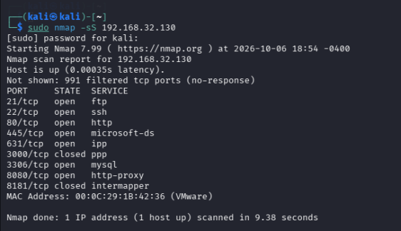
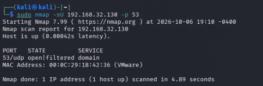
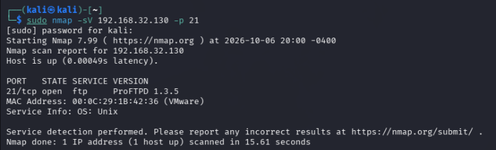

# Escaneo de puertos TCP y UDP en Metasploitable Ubuntu

Estado: en curso. Escaneos TCP y UDP documentados; detección del servicio y versión en 21/TCP realizada. Investigación de vulnerabilidades pendiente.

## Objetivo y entorno

Identificar estados de puertos TCP del objetivo propio `192.168.32.130` (Metasploitable Ubuntu) desde Kali. Práctica realizada durante la sección de recopilación activa de información del curso de hacking ético.

- Herramienta: Nmap 7.99, según la captura.
- Objetivo: Metasploitable3 Ubuntu 14.04, previamente comprobado mediante ping.
- Red del laboratorio configurada en modo Sólo host.
- Evidencia relacionada: [configuración y conectividad del laboratorio](https://github.com/gonzalo-rinaldi/cybersecurity-homelab/blob/main/docs/conectividad-kali-ubuntu.md).

## Comando ejecutado

```bash
sudo nmap -sS 192.168.32.130
```

La opción `-sS` selecciona el escaneo TCP SYN. El comando no solicita detección de versiones ni escaneo UDP. Tampoco solicita todos los puertos TCP.



## Resultados observados

El objetivo respondió como activo. Nmap informó 991 puertos TCP filtrados sin respuesta y mostró los siguientes nueve puertos:

| Puerto TCP | Estado | Etiqueta SERVICE mostrada, sin confirmar |
|---|---|---|
| 21 | open | ftp |
| 22 | open | ssh |
| 80 | open | http |
| 445 | open | microsoft-ds |
| 631 | open | ipp |
| 3000 | closed | ppp |
| 3306 | open | mysql |
| 8080 | open | http-proxy |
| 8181 | closed | intermapper |

Balance de esta ejecución: 7 puertos abiertos, 2 cerrados y 991 filtrados, sobre 1000 puertos TCP evaluados. Duración mostrada: 9.38 segundos.

## Interpretación propia

La columna `SERVICE` no garantiza que el servicio real coincida con el nombre mostrado. En este escaneo inicial las etiquetas se basan en la asociación habitual del número de puerto; no se identificó todavía el software ni su versión mediante sondeos de servicio.

- `open`: el puerto respondió de forma compatible con un puerto TCP abierto durante la prueba.
- `closed`: el puerto respondió como cerrado; su etiqueta no indica que haya un servicio ejecutándose.
- `filtered`: Nmap no pudo determinar si estaba abierto o cerrado. En esta captura se informa ausencia de respuesta; no se identificó la causa concreta.

Un puerto abierto no constituye por sí mismo una vulnerabilidad. El resultado describe lo observado desde Kali en ese momento.

## Prueba complementaria: puerto UDP 53

Se realizó una segunda prueba propia sobre el mismo objetivo:

```bash
sudo nmap -sU 192.168.32.130 -p 53
```

`-sU` selecciona un escaneo UDP y `-p 53` limita esta prueba al puerto 53. No es una repetición del escaneo TCP: se evalúa un protocolo diferente.



| Dato | Resultado observado |
|---|---|
| Objetivo | 192.168.32.130 |
| Puerto | 53/udp |
| Estado | open\|filtered |
| Etiqueta SERVICE | domain |
| Estado del host | Activo |
| Duración | 4.89 segundos |

Nmap no pudo distinguir entre un puerto UDP abierto y uno filtrado. Este resultado no confirma un servicio DNS activo. La etiqueta `domain` es una asociación habitual del puerto 53, no una identificación verificada del servicio. La captura no determina la causa concreta del estado ambiguo; no se atribuye a un firewall específico.

## Identificación de servicio y versión en 21/TCP

Se ejecutó desde Kali:

```bash
sudo nmap -sV 192.168.32.130 -p 21
```

La opción `-sV` solicita detección de servicios y versiones. `-p 21` limita el análisis al puerto 21.



| Dato | Resultado informado por Nmap |
|---|---|
| Puerto | 21/tcp |
| Estado | open |
| Servicio | ftp |
| Producto y versión | ProFTPD 1.3.5 |
| Información adicional | Service Info: OS: Unix |
| Duración | 15.61 segundos |

En el escaneo SYN inicial, `ftp` era una etiqueta asociada al puerto. Esta segunda prueba identifica mediante detección de servicio el producto ProFTPD y la versión 1.3.5. Se registra como identificación informada por Nmap, no como verificación local del paquete instalado. La indicación Unix procede de la información del servicio; no equivale a una detección completa del sistema operativo.

## Interpretación y siguiente fase

El producto y la versión permiten buscar vulnerabilidades candidatas en fuentes públicas y comparar los requisitos de posibles pruebas de concepto con el laboratorio. La coincidencia de versión, por sí sola, no demuestra una vulnerabilidad explotable: deben verificarse las condiciones relevantes, como configuración, módulos y parches.

Todavía no se ha investigado ni validado una vulnerabilidad concreta en este caso, ni se ha ejecutado un exploit. La investigación y eventual validación en el objetivo propio se documentarán como una fase separada con sus evidencias, impacto y mitigación.

## Continuación pendiente

La identificación de los demás puertos y la investigación de vulnerabilidades siguen pendientes.

La variante con `-v --reason` y exportación XML queda pendiente para la revisión final del portafolio, por decisión del autor.
