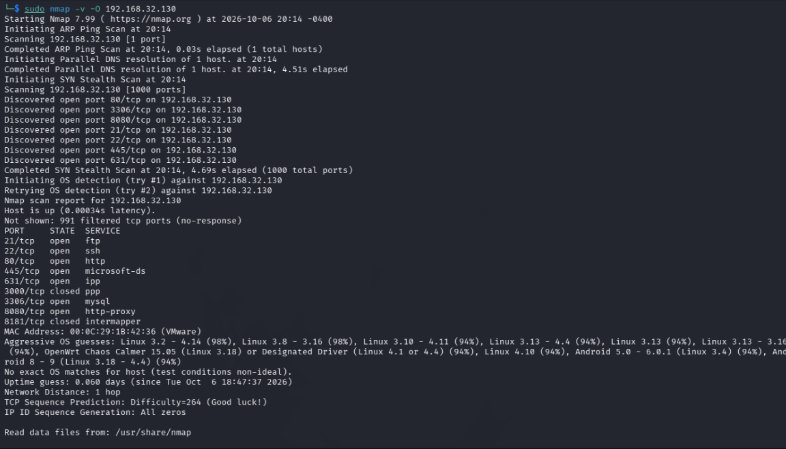

# Detección remota del sistema operativo con Nmap

Estado: prueba documentada; resultado aproximado, sin coincidencia exacta.

## Objetivo y entorno

Estimar el sistema operativo del objetivo propio Metasploitable Ubuntu (`192.168.32.130`) desde Kali, como parte del laboratorio de enumeración. Herramienta observada: Nmap 7.99. Los adaptadores del laboratorio están configurados en modo Sólo host.

## Comando ejecutado

```bash
sudo nmap -v -O 192.168.32.130
```

`-O` (letra O mayúscula) solicita detección del sistema operativo. `-v` muestra más detalle del progreso. Esta ejecución no incluye `-sV`: las etiquetas SERVICE de esta salida no reemplazan la identificación de productos realizada en la práctica anterior.



## Resultados observados

- Host activo; 7 puertos TCP abiertos, 2 cerrados y 991 filtrados sin respuesta, como en la prueba anterior.
- Nmap realizó un intento de detección del sistema operativo y un segundo intento.
- Entre las primeras aproximaciones figuran `Linux 3.2 - 4.14 (98%)` y `Linux 3.8 - 3.16 (98%)`.
- También aparecen otras aproximaciones con 94 %, incluidas variantes de Linux, OpenWrt y Android.
- Nmap advierte: `No exact OS matches for host (test conditions non-ideal).`
- Distancia de red informada: 1 salto.

La captura no incluye la línea final `Nmap done`; no se documenta una duración total de ejecución.

## Interpretación y contraste

La huella remota es compatible con Linux, pero Nmap no identificó de forma exacta una distribución ni una versión. Los porcentajes son puntuaciones de coincidencia informadas por la herramienta; no garantizan que una opción sea el sistema real. La lista de alternativas tampoco significa que el objetivo ejecute todos esos sistemas.

Existe una evidencia local anterior: la consola del objetivo muestra Ubuntu 14.04 LTS y kernel `3.13.0-24-generic`. Ese kernel es compatible con los rangos Linux propuestos. La información exacta de Ubuntu procede de esa consola, no de este escaneo.

Referencia: [evidencia local del objetivo y prueba de conectividad](https://github.com/gonzalo-rinaldi/cybersecurity-homelab/blob/main/docs/conectividad-kali-ubuntu.md).

## Aprendizaje

La detección remota permite orientar la investigación, pero debe conservarse la incertidumbre que muestra la herramienta y contrastarse con evidencias adicionales. Esta prueba no demuestra vulnerabilidades ni confirma por sí sola el estado de parches del sistema.
