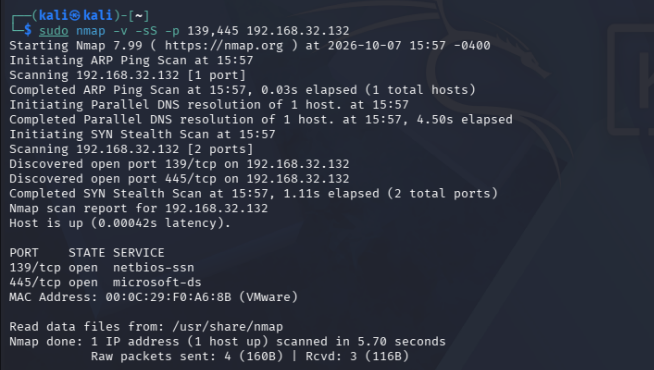
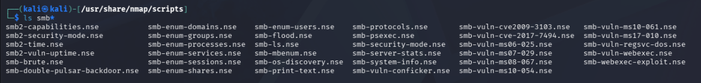
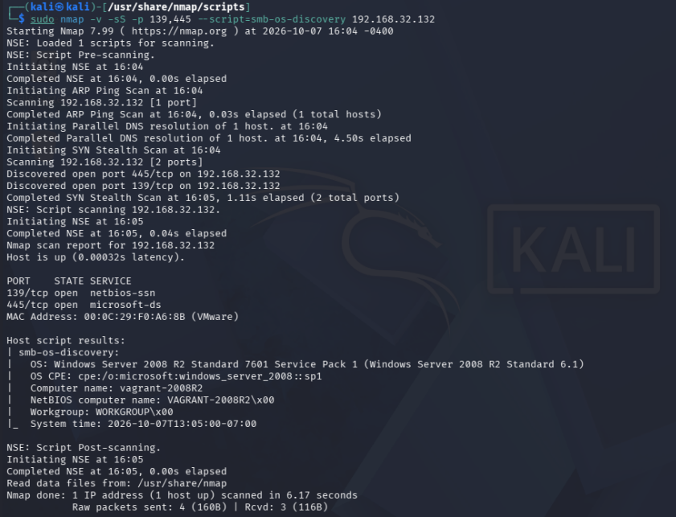
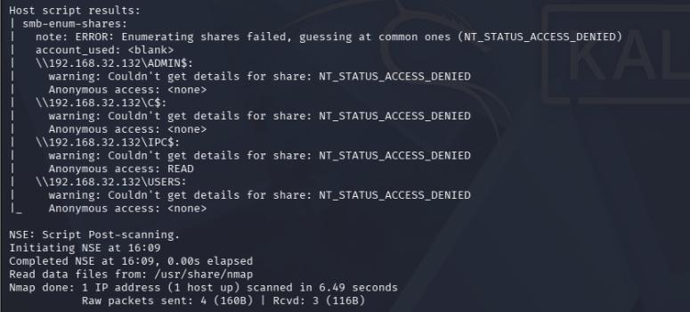

# Enumeración de Metasploitable Windows

Estado: escaneo dirigido, identificación del sistema y enumeración parcial de recursos SMB documentados; SNMP pendiente.

## Objetivo y entorno

Comprobar los puertos asociados habitualmente a SMB en el objetivo propio Metasploitable Windows (`192.168.32.132`), desde Kali con Nmap 7.99. El laboratorio está configurado en modo Sólo host.

La [conectividad ICMP](https://github.com/gonzalo-rinaldi/cybersecurity-homelab/blob/main/docs/conectividad-kali-windows.md) se verificó previamente con seis respuestas y ninguna pérdida.

## Comando ejecutado

```bash
sudo nmap -v -sS -p 139,445 192.168.32.132
```

- `-v`: muestra el progreso con mayor detalle.
- `-sS`: selecciona escaneo TCP SYN.
- `-p 139,445`: limita la prueba a esos dos puertos; la p es minúscula.



## Resultados observados

| Puerto | Estado | Etiqueta SERVICE |
|---|---|---|
| 139/tcp | open | netbios-ssn |
| 445/tcp | open | microsoft-ds |

La salida confirma que se escanearon únicamente dos puertos. El objetivo está activo y la duración total informada es de 5.70 segundos.

## Interpretación y límites

Ambos puertos están abiertos desde la perspectiva de Kali. El resultado permite continuar con la enumeración SMB, pero todavía no identifica versiones del protocolo, usuarios, recursos compartidos ni permisos. Un puerto abierto no demuestra una vulnerabilidad.

No se utilizó `-sV`; las etiquetas SERVICE son asociaciones habituales de los puertos y no una identificación confirmada del software que responde.

## Exploración local de scripts NSE relacionados con SMB

Se navegó al directorio de scripts de Nmap y se listaron los archivos cuyo nombre comienza con `smb`:

```bash
cd /usr/share/nmap/scripts
ls smb*
```




El listado incluye scripts como `smb-enum-shares.nse`, `smb-enum-users.nse`, `smb-os-discovery.nse`, `smb-protocols.nse`, `smb2-security-mode.nse` y otros orientados a comprobaciones de vulnerabilidades o acciones más intrusivas.

NSE (Nmap Scripting Engine) permite automatizar tareas de descubrimiento, enumeración y detección de vulnerabilidades; algunos scripts también implementan explotación. No todos los scripts SMB realizan la misma tarea y comprobar una vulnerabilidad no equivale necesariamente a explotarla. Referencia técnica: [documentación oficial de NSE](https://nmap.org/book/nse.html).

Estos comandos únicamente inspeccionan archivos locales: no ejecutan scripts contra Windows ni demuestran vulnerabilidades del objetivo. En esta etapa aún no se había ejecutado enumeración remota; la siguiente sección documenta su primera ejecución. Antes de usar un script se revisará su función y sus requisitos; no se ejecutará indiscriminadamente todo el conjunto mostrado.

## Identificación del sistema mediante SMB

Se ejecutó el script `smb-os-discovery` contra el objetivo del laboratorio:

```bash
sudo nmap -v -sS -p 139,445 --script=smb-os-discovery 192.168.32.132
```



Nmap cargó un script y mostró resultados de `smb-os-discovery`. Los puertos 139/TCP y 445/TCP siguieron abiertos. Duración total: 6.17 segundos.

| Campo | Información reportada |
|---|---|
| Sistema operativo | Windows Server 2008 R2 Standard |
| Compilación | 7601 |
| Service Pack | Service Pack 1 |
| Versión adicional | Windows Server 2008 R2 Standard 6.1 |
| CPE | `cpe:/o:microsoft:windows_server_2008::sp1` |
| Nombre del equipo | `vagrant-2008R2` |
| Nombre NetBIOS | `VAGRANT-2008R2` |
| Grupo de trabajo | `WORKGROUP` |

La captura muestra terminadores `\x00` en los campos NetBIOS y grupo de trabajo; la tabla presenta los nombres sin esos terminadores.

### Interpretación

Esta ejecución sí obtuvo información remota mediante SMB. El servicio reporta edición, compilación y Service Pack del sistema, además de los nombres del equipo y grupo de trabajo. Es una identificación más específica que las aproximaciones por huella de red mostradas en la práctica de `-O` sobre Ubuntu.

Se conserva la distinción entre datos reportados por SMB y comprobación local: este resultado no verifica todos los parches instalados ni demuestra una vulnerabilidad. Tampoco enumera usuarios o recursos compartidos. No se ejecutó un exploit.

## Enumeración de recursos compartidos

```bash
sudo nmap -v -sS -p 139,445 --script=smb-enum-shares 192.168.32.132
```




Los puertos 139/TCP y 445/TCP permanecen abiertos. El script informa `account_used: <blank>` y la consulta inicial de enumeración falla con `NT_STATUS_ACCESS_DENIED`. A continuación prueba nombres comunes de recursos, como indica `guessing at common ones`. Duración total: 6.49 segundos.

| Recurso mostrado | Acceso anónimo informado | Detalles del recurso |
|---|---|---|
| `ADMIN# Enumeración de Metasploitable Windows

Estado: escaneo dirigido, identificación del sistema y enumeración parcial de recursos SMB documentados; SNMP pendiente.

## Objetivo y entorno

Comprobar los puertos asociados habitualmente a SMB en el objetivo propio Metasploitable Windows (`192.168.32.132`), desde Kali con Nmap 7.99. El laboratorio está configurado en modo Sólo host.

La [conectividad ICMP](https://github.com/gonzalo-rinaldi/cybersecurity-homelab/blob/main/docs/conectividad-kali-windows.md) se verificó previamente con seis respuestas y ninguna pérdida.

## Comando ejecutado

```bash
sudo nmap -v -sS -p 139,445 192.168.32.132
```

- `-v`: muestra el progreso con mayor detalle.
- `-sS`: selecciona escaneo TCP SYN.
- `-p 139,445`: limita la prueba a esos dos puertos; la p es minúscula.


## Resultados observados

| Puerto | Estado | Etiqueta SERVICE |
|---|---|---|
| 139/tcp | open | netbios-ssn |
| 445/tcp | open | microsoft-ds |

La salida confirma que se escanearon únicamente dos puertos. El objetivo está activo y la duración total informada es de 5.70 segundos.

## Interpretación y límites

Ambos puertos están abiertos desde la perspectiva de Kali. El resultado permite continuar con la enumeración SMB, pero todavía no identifica versiones del protocolo, usuarios, recursos compartidos ni permisos. Un puerto abierto no demuestra una vulnerabilidad.

No se utilizó `-sV`; las etiquetas SERVICE son asociaciones habituales de los puertos y no una identificación confirmada del software que responde.

## Exploración local de scripts NSE relacionados con SMB

Se navegó al directorio de scripts de Nmap y se listaron los archivos cuyo nombre comienza con `smb`:

```bash
cd /usr/share/nmap/scripts
ls smb*
```


El listado incluye scripts como `smb-enum-shares.nse`, `smb-enum-users.nse`, `smb-os-discovery.nse`, `smb-protocols.nse`, `smb2-security-mode.nse` y otros orientados a comprobaciones de vulnerabilidades o acciones más intrusivas.

NSE (Nmap Scripting Engine) permite automatizar tareas de descubrimiento, enumeración y detección de vulnerabilidades; algunos scripts también implementan explotación. No todos los scripts SMB realizan la misma tarea y comprobar una vulnerabilidad no equivale necesariamente a explotarla. Referencia técnica: [documentación oficial de NSE](https://nmap.org/book/nse.html).

Estos comandos únicamente inspeccionan archivos locales: no ejecutan scripts contra Windows ni demuestran vulnerabilidades del objetivo. En esta etapa aún no se había ejecutado enumeración remota; la siguiente sección documenta su primera ejecución. Antes de usar un script se revisará su función y sus requisitos; no se ejecutará indiscriminadamente todo el conjunto mostrado.

## Identificación del sistema mediante SMB

Se ejecutó el script `smb-os-discovery` contra el objetivo del laboratorio:

```bash
sudo nmap -v -sS -p 139,445 --script=smb-os-discovery 192.168.32.132
```


Nmap cargó un script y mostró resultados de `smb-os-discovery`. Los puertos 139/TCP y 445/TCP siguieron abiertos. Duración total: 6.17 segundos.

| Campo | Información reportada |
|---|---|
| Sistema operativo | Windows Server 2008 R2 Standard |
| Compilación | 7601 |
| Service Pack | Service Pack 1 |
| Versión adicional | Windows Server 2008 R2 Standard 6.1 |
| CPE | `cpe:/o:microsoft:windows_server_2008::sp1` |
| Nombre del equipo | `vagrant-2008R2` |
| Nombre NetBIOS | `VAGRANT-2008R2` |
| Grupo de trabajo | `WORKGROUP` |

La captura muestra terminadores `\x00` en los campos NetBIOS y grupo de trabajo; la tabla presenta los nombres sin esos terminadores.

### Interpretación

Esta ejecución sí obtuvo información remota mediante SMB. El servicio reporta edición, compilación y Service Pack del sistema, además de los nombres del equipo y grupo de trabajo. Es una identificación más específica que las aproximaciones por huella de red mostradas en la práctica de `-O` sobre Ubuntu.

Se conserva la distinción entre datos reportados por SMB y comprobación local: este resultado no verifica todos los parches instalados ni demuestra una vulnerabilidad. Tampoco enumera usuarios o recursos compartidos. No se ejecutó un exploit.

 | `<none>` | Acceso denegado |
| `C# Enumeración de Metasploitable Windows

Estado: escaneo dirigido, identificación del sistema y enumeración parcial de recursos SMB documentados; SNMP pendiente.

## Objetivo y entorno

Comprobar los puertos asociados habitualmente a SMB en el objetivo propio Metasploitable Windows (`192.168.32.132`), desde Kali con Nmap 7.99. El laboratorio está configurado en modo Sólo host.

La [conectividad ICMP](https://github.com/gonzalo-rinaldi/cybersecurity-homelab/blob/main/docs/conectividad-kali-windows.md) se verificó previamente con seis respuestas y ninguna pérdida.

## Comando ejecutado

```bash
sudo nmap -v -sS -p 139,445 192.168.32.132
```

- `-v`: muestra el progreso con mayor detalle.
- `-sS`: selecciona escaneo TCP SYN.
- `-p 139,445`: limita la prueba a esos dos puertos; la p es minúscula.


## Resultados observados

| Puerto | Estado | Etiqueta SERVICE |
|---|---|---|
| 139/tcp | open | netbios-ssn |
| 445/tcp | open | microsoft-ds |

La salida confirma que se escanearon únicamente dos puertos. El objetivo está activo y la duración total informada es de 5.70 segundos.

## Interpretación y límites

Ambos puertos están abiertos desde la perspectiva de Kali. El resultado permite continuar con la enumeración SMB, pero todavía no identifica versiones del protocolo, usuarios, recursos compartidos ni permisos. Un puerto abierto no demuestra una vulnerabilidad.

No se utilizó `-sV`; las etiquetas SERVICE son asociaciones habituales de los puertos y no una identificación confirmada del software que responde.

## Exploración local de scripts NSE relacionados con SMB

Se navegó al directorio de scripts de Nmap y se listaron los archivos cuyo nombre comienza con `smb`:

```bash
cd /usr/share/nmap/scripts
ls smb*
```


El listado incluye scripts como `smb-enum-shares.nse`, `smb-enum-users.nse`, `smb-os-discovery.nse`, `smb-protocols.nse`, `smb2-security-mode.nse` y otros orientados a comprobaciones de vulnerabilidades o acciones más intrusivas.

NSE (Nmap Scripting Engine) permite automatizar tareas de descubrimiento, enumeración y detección de vulnerabilidades; algunos scripts también implementan explotación. No todos los scripts SMB realizan la misma tarea y comprobar una vulnerabilidad no equivale necesariamente a explotarla. Referencia técnica: [documentación oficial de NSE](https://nmap.org/book/nse.html).

Estos comandos únicamente inspeccionan archivos locales: no ejecutan scripts contra Windows ni demuestran vulnerabilidades del objetivo. En esta etapa aún no se había ejecutado enumeración remota; la siguiente sección documenta su primera ejecución. Antes de usar un script se revisará su función y sus requisitos; no se ejecutará indiscriminadamente todo el conjunto mostrado.

## Identificación del sistema mediante SMB

Se ejecutó el script `smb-os-discovery` contra el objetivo del laboratorio:

```bash
sudo nmap -v -sS -p 139,445 --script=smb-os-discovery 192.168.32.132
```


Nmap cargó un script y mostró resultados de `smb-os-discovery`. Los puertos 139/TCP y 445/TCP siguieron abiertos. Duración total: 6.17 segundos.

| Campo | Información reportada |
|---|---|
| Sistema operativo | Windows Server 2008 R2 Standard |
| Compilación | 7601 |
| Service Pack | Service Pack 1 |
| Versión adicional | Windows Server 2008 R2 Standard 6.1 |
| CPE | `cpe:/o:microsoft:windows_server_2008::sp1` |
| Nombre del equipo | `vagrant-2008R2` |
| Nombre NetBIOS | `VAGRANT-2008R2` |
| Grupo de trabajo | `WORKGROUP` |

La captura muestra terminadores `\x00` en los campos NetBIOS y grupo de trabajo; la tabla presenta los nombres sin esos terminadores.

### Interpretación

Esta ejecución sí obtuvo información remota mediante SMB. El servicio reporta edición, compilación y Service Pack del sistema, además de los nombres del equipo y grupo de trabajo. Es una identificación más específica que las aproximaciones por huella de red mostradas en la práctica de `-O` sobre Ubuntu.

Se conserva la distinción entre datos reportados por SMB y comprobación local: este resultado no verifica todos los parches instalados ni demuestra una vulnerabilidad. Tampoco enumera usuarios o recursos compartidos. No se ejecutó un exploit.

 | `<none>` | Acceso denegado |
| `IPC# Enumeración de Metasploitable Windows

Estado: escaneo dirigido, identificación del sistema y enumeración parcial de recursos SMB documentados; SNMP pendiente.

## Objetivo y entorno

Comprobar los puertos asociados habitualmente a SMB en el objetivo propio Metasploitable Windows (`192.168.32.132`), desde Kali con Nmap 7.99. El laboratorio está configurado en modo Sólo host.

La [conectividad ICMP](https://github.com/gonzalo-rinaldi/cybersecurity-homelab/blob/main/docs/conectividad-kali-windows.md) se verificó previamente con seis respuestas y ninguna pérdida.

## Comando ejecutado

```bash
sudo nmap -v -sS -p 139,445 192.168.32.132
```

- `-v`: muestra el progreso con mayor detalle.
- `-sS`: selecciona escaneo TCP SYN.
- `-p 139,445`: limita la prueba a esos dos puertos; la p es minúscula.


## Resultados observados

| Puerto | Estado | Etiqueta SERVICE |
|---|---|---|
| 139/tcp | open | netbios-ssn |
| 445/tcp | open | microsoft-ds |

La salida confirma que se escanearon únicamente dos puertos. El objetivo está activo y la duración total informada es de 5.70 segundos.

## Interpretación y límites

Ambos puertos están abiertos desde la perspectiva de Kali. El resultado permite continuar con la enumeración SMB, pero todavía no identifica versiones del protocolo, usuarios, recursos compartidos ni permisos. Un puerto abierto no demuestra una vulnerabilidad.

No se utilizó `-sV`; las etiquetas SERVICE son asociaciones habituales de los puertos y no una identificación confirmada del software que responde.

## Exploración local de scripts NSE relacionados con SMB

Se navegó al directorio de scripts de Nmap y se listaron los archivos cuyo nombre comienza con `smb`:

```bash
cd /usr/share/nmap/scripts
ls smb*
```


El listado incluye scripts como `smb-enum-shares.nse`, `smb-enum-users.nse`, `smb-os-discovery.nse`, `smb-protocols.nse`, `smb2-security-mode.nse` y otros orientados a comprobaciones de vulnerabilidades o acciones más intrusivas.

NSE (Nmap Scripting Engine) permite automatizar tareas de descubrimiento, enumeración y detección de vulnerabilidades; algunos scripts también implementan explotación. No todos los scripts SMB realizan la misma tarea y comprobar una vulnerabilidad no equivale necesariamente a explotarla. Referencia técnica: [documentación oficial de NSE](https://nmap.org/book/nse.html).

Estos comandos únicamente inspeccionan archivos locales: no ejecutan scripts contra Windows ni demuestran vulnerabilidades del objetivo. En esta etapa aún no se había ejecutado enumeración remota; la siguiente sección documenta su primera ejecución. Antes de usar un script se revisará su función y sus requisitos; no se ejecutará indiscriminadamente todo el conjunto mostrado.

## Identificación del sistema mediante SMB

Se ejecutó el script `smb-os-discovery` contra el objetivo del laboratorio:

```bash
sudo nmap -v -sS -p 139,445 --script=smb-os-discovery 192.168.32.132
```


Nmap cargó un script y mostró resultados de `smb-os-discovery`. Los puertos 139/TCP y 445/TCP siguieron abiertos. Duración total: 6.17 segundos.

| Campo | Información reportada |
|---|---|
| Sistema operativo | Windows Server 2008 R2 Standard |
| Compilación | 7601 |
| Service Pack | Service Pack 1 |
| Versión adicional | Windows Server 2008 R2 Standard 6.1 |
| CPE | `cpe:/o:microsoft:windows_server_2008::sp1` |
| Nombre del equipo | `vagrant-2008R2` |
| Nombre NetBIOS | `VAGRANT-2008R2` |
| Grupo de trabajo | `WORKGROUP` |

La captura muestra terminadores `\x00` en los campos NetBIOS y grupo de trabajo; la tabla presenta los nombres sin esos terminadores.

### Interpretación

Esta ejecución sí obtuvo información remota mediante SMB. El servicio reporta edición, compilación y Service Pack del sistema, además de los nombres del equipo y grupo de trabajo. Es una identificación más específica que las aproximaciones por huella de red mostradas en la práctica de `-O` sobre Ubuntu.

Se conserva la distinción entre datos reportados por SMB y comprobación local: este resultado no verifica todos los parches instalados ni demuestra una vulnerabilidad. Tampoco enumera usuarios o recursos compartidos. No se ejecutó un exploit.

 | `READ` | Acceso denegado |
| `USERS` | `<none>` | Acceso denegado |

### Interpretación

La consulta no produjo un inventario completo de recursos compartidos. El script recurrió a comprobar nombres habituales y no pudo obtener los detalles de ninguno de los cuatro mostrados. Este comportamiento de reserva está descrito en la [documentación oficial de smb-enum-shares](https://nmap.org/nsedoc/scripts/smb-enum-shares.html).

El valor `READ` en `IPC# Enumeración de Metasploitable Windows

Estado: escaneo dirigido, identificación del sistema y enumeración parcial de recursos SMB documentados; SNMP pendiente.

## Objetivo y entorno

Comprobar los puertos asociados habitualmente a SMB en el objetivo propio Metasploitable Windows (`192.168.32.132`), desde Kali con Nmap 7.99. El laboratorio está configurado en modo Sólo host.

La [conectividad ICMP](https://github.com/gonzalo-rinaldi/cybersecurity-homelab/blob/main/docs/conectividad-kali-windows.md) se verificó previamente con seis respuestas y ninguna pérdida.

## Comando ejecutado

```bash
sudo nmap -v -sS -p 139,445 192.168.32.132
```

- `-v`: muestra el progreso con mayor detalle.
- `-sS`: selecciona escaneo TCP SYN.
- `-p 139,445`: limita la prueba a esos dos puertos; la p es minúscula.


## Resultados observados

| Puerto | Estado | Etiqueta SERVICE |
|---|---|---|
| 139/tcp | open | netbios-ssn |
| 445/tcp | open | microsoft-ds |

La salida confirma que se escanearon únicamente dos puertos. El objetivo está activo y la duración total informada es de 5.70 segundos.

## Interpretación y límites

Ambos puertos están abiertos desde la perspectiva de Kali. El resultado permite continuar con la enumeración SMB, pero todavía no identifica versiones del protocolo, usuarios, recursos compartidos ni permisos. Un puerto abierto no demuestra una vulnerabilidad.

No se utilizó `-sV`; las etiquetas SERVICE son asociaciones habituales de los puertos y no una identificación confirmada del software que responde.

## Exploración local de scripts NSE relacionados con SMB

Se navegó al directorio de scripts de Nmap y se listaron los archivos cuyo nombre comienza con `smb`:

```bash
cd /usr/share/nmap/scripts
ls smb*
```


El listado incluye scripts como `smb-enum-shares.nse`, `smb-enum-users.nse`, `smb-os-discovery.nse`, `smb-protocols.nse`, `smb2-security-mode.nse` y otros orientados a comprobaciones de vulnerabilidades o acciones más intrusivas.

NSE (Nmap Scripting Engine) permite automatizar tareas de descubrimiento, enumeración y detección de vulnerabilidades; algunos scripts también implementan explotación. No todos los scripts SMB realizan la misma tarea y comprobar una vulnerabilidad no equivale necesariamente a explotarla. Referencia técnica: [documentación oficial de NSE](https://nmap.org/book/nse.html).

Estos comandos únicamente inspeccionan archivos locales: no ejecutan scripts contra Windows ni demuestran vulnerabilidades del objetivo. En esta etapa aún no se había ejecutado enumeración remota; la siguiente sección documenta su primera ejecución. Antes de usar un script se revisará su función y sus requisitos; no se ejecutará indiscriminadamente todo el conjunto mostrado.

## Identificación del sistema mediante SMB

Se ejecutó el script `smb-os-discovery` contra el objetivo del laboratorio:

```bash
sudo nmap -v -sS -p 139,445 --script=smb-os-discovery 192.168.32.132
```


Nmap cargó un script y mostró resultados de `smb-os-discovery`. Los puertos 139/TCP y 445/TCP siguieron abiertos. Duración total: 6.17 segundos.

| Campo | Información reportada |
|---|---|
| Sistema operativo | Windows Server 2008 R2 Standard |
| Compilación | 7601 |
| Service Pack | Service Pack 1 |
| Versión adicional | Windows Server 2008 R2 Standard 6.1 |
| CPE | `cpe:/o:microsoft:windows_server_2008::sp1` |
| Nombre del equipo | `vagrant-2008R2` |
| Nombre NetBIOS | `VAGRANT-2008R2` |
| Grupo de trabajo | `WORKGROUP` |

La captura muestra terminadores `\x00` en los campos NetBIOS y grupo de trabajo; la tabla presenta los nombres sin esos terminadores.

### Interpretación

Esta ejecución sí obtuvo información remota mediante SMB. El servicio reporta edición, compilación y Service Pack del sistema, además de los nombres del equipo y grupo de trabajo. Es una identificación más específica que las aproximaciones por huella de red mostradas en la práctica de `-O` sobre Ubuntu.

Se conserva la distinción entre datos reportados por SMB y comprobación local: este resultado no verifica todos los parches instalados ni demuestra una vulnerabilidad. Tampoco enumera usuarios o recursos compartidos. No se ejecutó un exploit.

 se conserva como resultado de la herramienta. `IPC# Enumeración de Metasploitable Windows

Estado: escaneo dirigido, identificación del sistema y enumeración parcial de recursos SMB documentados; SNMP pendiente.

## Objetivo y entorno

Comprobar los puertos asociados habitualmente a SMB en el objetivo propio Metasploitable Windows (`192.168.32.132`), desde Kali con Nmap 7.99. El laboratorio está configurado en modo Sólo host.

La [conectividad ICMP](https://github.com/gonzalo-rinaldi/cybersecurity-homelab/blob/main/docs/conectividad-kali-windows.md) se verificó previamente con seis respuestas y ninguna pérdida.

## Comando ejecutado

```bash
sudo nmap -v -sS -p 139,445 192.168.32.132
```

- `-v`: muestra el progreso con mayor detalle.
- `-sS`: selecciona escaneo TCP SYN.
- `-p 139,445`: limita la prueba a esos dos puertos; la p es minúscula.


## Resultados observados

| Puerto | Estado | Etiqueta SERVICE |
|---|---|---|
| 139/tcp | open | netbios-ssn |
| 445/tcp | open | microsoft-ds |

La salida confirma que se escanearon únicamente dos puertos. El objetivo está activo y la duración total informada es de 5.70 segundos.

## Interpretación y límites

Ambos puertos están abiertos desde la perspectiva de Kali. El resultado permite continuar con la enumeración SMB, pero todavía no identifica versiones del protocolo, usuarios, recursos compartidos ni permisos. Un puerto abierto no demuestra una vulnerabilidad.

No se utilizó `-sV`; las etiquetas SERVICE son asociaciones habituales de los puertos y no una identificación confirmada del software que responde.

## Exploración local de scripts NSE relacionados con SMB

Se navegó al directorio de scripts de Nmap y se listaron los archivos cuyo nombre comienza con `smb`:

```bash
cd /usr/share/nmap/scripts
ls smb*
```


El listado incluye scripts como `smb-enum-shares.nse`, `smb-enum-users.nse`, `smb-os-discovery.nse`, `smb-protocols.nse`, `smb2-security-mode.nse` y otros orientados a comprobaciones de vulnerabilidades o acciones más intrusivas.

NSE (Nmap Scripting Engine) permite automatizar tareas de descubrimiento, enumeración y detección de vulnerabilidades; algunos scripts también implementan explotación. No todos los scripts SMB realizan la misma tarea y comprobar una vulnerabilidad no equivale necesariamente a explotarla. Referencia técnica: [documentación oficial de NSE](https://nmap.org/book/nse.html).

Estos comandos únicamente inspeccionan archivos locales: no ejecutan scripts contra Windows ni demuestran vulnerabilidades del objetivo. En esta etapa aún no se había ejecutado enumeración remota; la siguiente sección documenta su primera ejecución. Antes de usar un script se revisará su función y sus requisitos; no se ejecutará indiscriminadamente todo el conjunto mostrado.

## Identificación del sistema mediante SMB

Se ejecutó el script `smb-os-discovery` contra el objetivo del laboratorio:

```bash
sudo nmap -v -sS -p 139,445 --script=smb-os-discovery 192.168.32.132
```


Nmap cargó un script y mostró resultados de `smb-os-discovery`. Los puertos 139/TCP y 445/TCP siguieron abiertos. Duración total: 6.17 segundos.

| Campo | Información reportada |
|---|---|
| Sistema operativo | Windows Server 2008 R2 Standard |
| Compilación | 7601 |
| Service Pack | Service Pack 1 |
| Versión adicional | Windows Server 2008 R2 Standard 6.1 |
| CPE | `cpe:/o:microsoft:windows_server_2008::sp1` |
| Nombre del equipo | `vagrant-2008R2` |
| Nombre NetBIOS | `VAGRANT-2008R2` |
| Grupo de trabajo | `WORKGROUP` |

La captura muestra terminadores `\x00` en los campos NetBIOS y grupo de trabajo; la tabla presenta los nombres sin esos terminadores.

### Interpretación

Esta ejecución sí obtuvo información remota mediante SMB. El servicio reporta edición, compilación y Service Pack del sistema, además de los nombres del equipo y grupo de trabajo. Es una identificación más específica que las aproximaciones por huella de red mostradas en la práctica de `-O` sobre Ubuntu.

Se conserva la distinción entre datos reportados por SMB y comprobación local: este resultado no verifica todos los parches instalados ni demuestra una vulnerabilidad. Tampoco enumera usuarios o recursos compartidos. No se ejecutó un exploit.

 es un recurso de comunicación entre procesos, no una carpeta de documentos; esta salida no demuestra lectura de archivos de usuario, acceso al disco C ni permisos de escritura. No se confirmó explotación ni una vulnerabilidad concreta.

La prueba muestra que es posible obtener información parcial incluso cuando la enumeración general está restringida. No se cambiaron permisos para forzar un resultado diferente.

## Pendientes

- La enumeración SMB prevista queda documentada; consultas adicionales son opcionales.
- Evaluar SNMP mediante una prueba específica: este escaneo TCP no verifica su disponibilidad por UDP.
