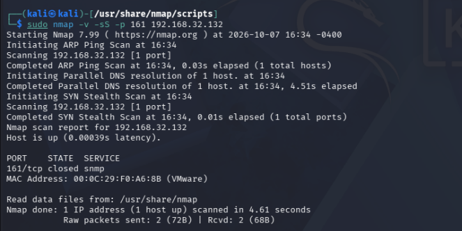
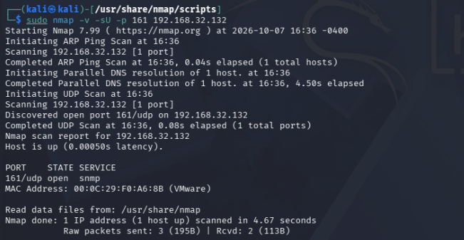
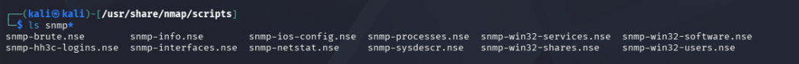
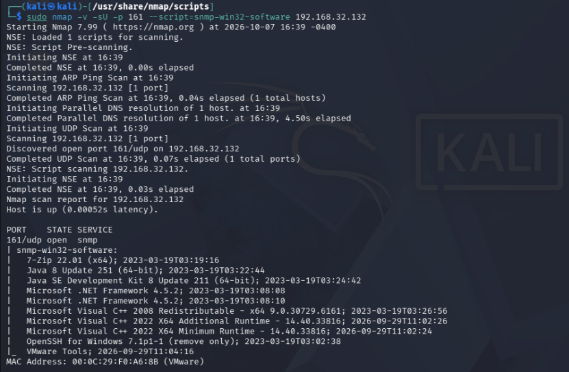

# Enumeración SNMP en Metasploitable Windows

Estado: comparación TCP/UDP e inventario remoto de software documentados.

## Objetivo y entorno

Consultar el servicio SNMP del objetivo propio `192.168.32.132` desde Kali con Nmap 7.99. SNMP permite obtener información de gestión de dispositivos y servidores. En esta práctica se consulta el puerto 161/UDP de Metasploitable Windows.

## 1. Comparación de transportes

```bash
sudo nmap -v -sS -p 161 192.168.32.132
```



Resultado: `161/tcp closed snmp`. Duración: 4.61 segundos. La etiqueta `snmp` junto a un puerto cerrado no significa que exista un servicio SNMP por TCP.

```bash
sudo nmap -v -sU -p 161 192.168.32.132
```



Resultado: `161/udp open snmp`. Duración: 4.67 segundos. Son dos pruebas distintas: el estado de un puerto TCP no determina el del mismo número en UDP. En este objetivo el acceso SNMP observado es por UDP; no se generaliza que toda implementación SNMP deba usar exclusivamente ese transporte.

## 2. Scripts disponibles

Desde `/usr/share/nmap/scripts` se ejecutó:

```bash
ls snmp*
```



Este paso únicamente muestra archivos locales. La consulta remota se realiza en el paso siguiente.

## 3. Consulta de software instalado

```bash
sudo nmap -v -sU -p 161 --script=snmp-win32-software 192.168.32.132
```



El script devolvió las siguientes entradas visibles:

| Software informado | Versión o detalle visible |
|---|---|
| 7-Zip | 22.01 (x64) |
| Java 8 | Update 251 (64-bit) |
| Java SE Development Kit 8 | Update 211 (64-bit) |
| Microsoft .NET Framework | 4.5.2; aparece en dos entradas |
| Microsoft Visual C++ 2008 Redistributable | x64 9.0.30729.6161 |
| Microsoft Visual C++ 2022 X64 Additional Runtime | 14.40.33816 |
| Microsoft Visual C++ 2022 X64 Minimum Runtime | 14.40.33816 |
| OpenSSH for Windows | 7.1p1-1 (remove only) |
| VMware Tools | Sin versión visible |

Se transcriben nombres y versiones tal como fueron reportados, sin afirmar que sea un inventario exhaustivo o actualizado de todos los programas. La captura también muestra marcas temporales, que no se verificaron independientemente. No aparece el resumen final de esta ejecución; no se atribuye una duración total al script.

## Interpretación y límites

Kali consiguió consultar información de software del servidor mediante SNMP. Esto aporta nombres y versiones para una investigación posterior, pero no demuestra que los programas estén ejecutándose, sean accesibles por red o tengan vulnerabilidades explotables.

El comando no especifica explícitamente una comunidad ni una versión de SNMP. La captura no permite confirmar cuál se utilizó ni que hubiera acceso de escritura. No se interpreta como ausencia de autenticación ni se documenta explotación.

## Perspectiva defensiva

El inventario remoto puede revelar información útil a equipos con acceso a la red. Como recomendaciones pendientes de aplicación: revisar si SNMP es necesario, restringir las consultas a los gestores autorizados y limitar la información accesible. No se han modificado configuraciones ni verificado correcciones en esta práctica.

## Referencia técnica

[Documentación oficial de snmp-win32-software](https://nmap.org/nsedoc/scripts/snmp-win32-software.html).
