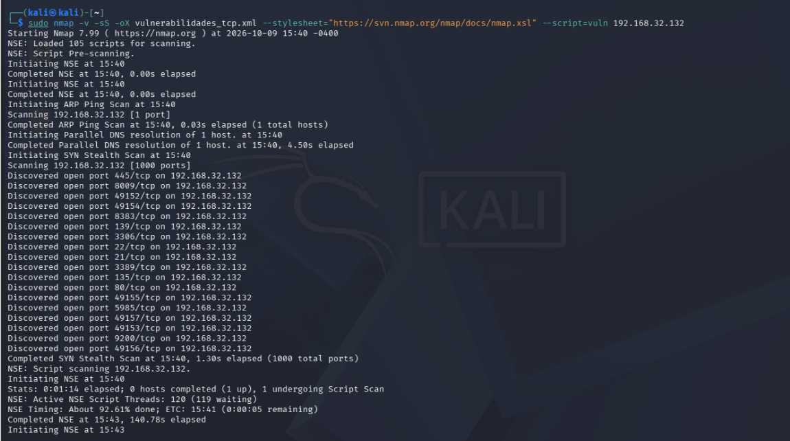
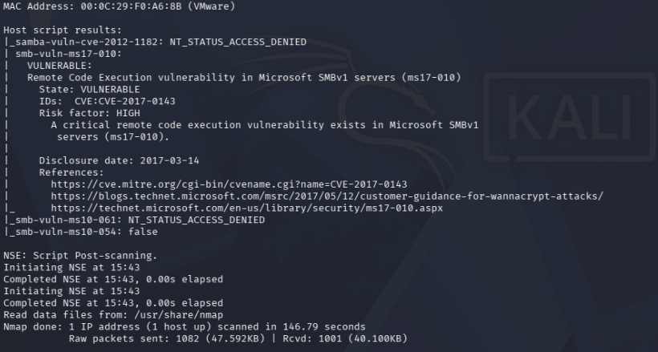
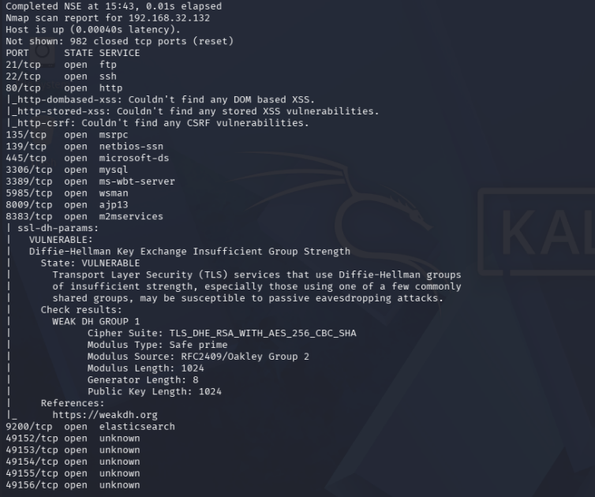
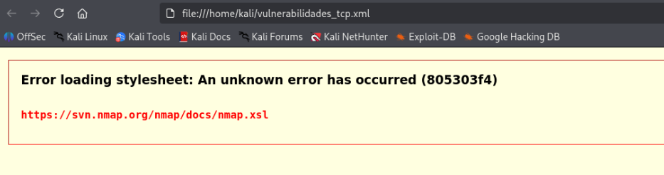
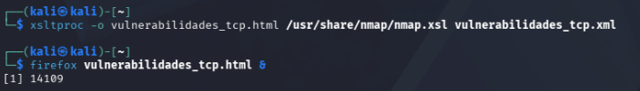
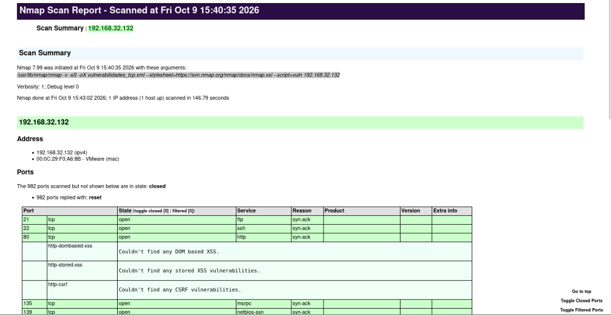
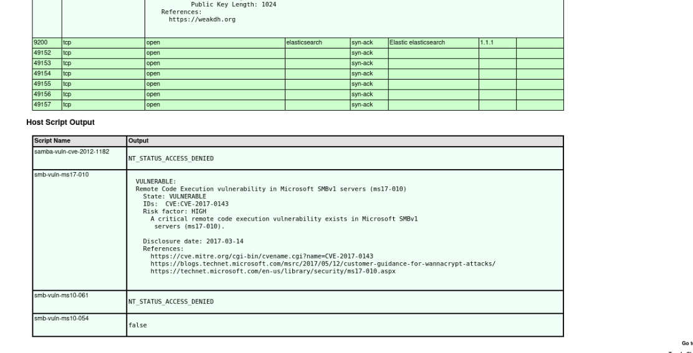

# Análisis de vulnerabilidades en Metasploitable Windows

Estado: resultados de Nmap y conversión del informe a HTML documentados; problema de visualización resuelto. Contraste con Nessus, verificación independiente y correcciones pendientes.

## Objetivo y alcance

Evaluar el objetivo propio `192.168.32.132` desde Kali, usando Nmap 7.99. La [enumeración previa](../../02-enumeracion/03-enumeracion-windows/README.md) identificó mediante SMB Windows Server 2008 R2 Standard, compilación 7601, SP1. El entorno está configurado en modo Sólo host.

## Ejecución

```bash
sudo nmap -v -sS -oX vulnerabilidades_tcp.xml --stylesheet="https://svn.nmap.org/nmap/docs/nmap.xsl" --script=vuln 192.168.32.132
```

Se solicitó un escaneo TCP SYN y scripts de la categoría `vuln`, con salida XML. No se añadió `-sV` ni se analizaron puertos UDP. La selección por categoría no equivale a comprobar todas las vulnerabilidades posibles.



La ejecución cargó 105 scripts, escaneó 1000 puertos TCP y finalizó en 146.79 segundos. Cargar un script no implica que todos sus controles hayan sido aplicables o se hayan completado.

El resumen informa 982 puertos cerrados, es decir, 18 abiertos en esta ejecución. La lista difiere del escaneo general anterior de Windows; no se atribuye esa diferencia a una corrección ni a cambios concretos sin evidencia adicional.

## Hallazgos seleccionados

| Hallazgo | Evidencia de Nmap | Estado de validación |
|---|---|---|
| MS17-010 en SMBv1 | `smb-vuln-ms17-010: VULNERABLE`; identifica CVE-2017-0143 y riesgo HIGH | Detección positiva del script; pendiente de contraste independiente |
| Grupo Diffie-Hellman de fuerza insuficiente, 8383/TCP | `ssl-dh-params: VULNERABLE`; módulo de 1024 bits | Parámetros reportados por el script; corrección y nueva prueba pendientes |

### 1. MS17-010



La salida reporta riesgo de ejecución remota de código en SMBv1. Se conserva CVE-2017-0143 tal como aparece en el resultado; no se sustituyen identificadores ni se agregan puntuaciones CVSS que la evidencia no muestra.

El script evalúa respuestas del servidor SMB para detectar el problema. Esta prueba no muestra ejecución de comandos, acceso remoto conseguido ni explotación exitosa. Se propone priorizar su revisión por el impacto indicado, comprobar los parches del sistema y contrastar con Nessus.

Referencia: [documentación de smb-vuln-ms17-010](https://nmap.org/nsedoc/scripts/smb-vuln-ms17-010.html).

### 2. Parámetros Diffie-Hellman débiles



El script informa:

- Suite: `TLS_DHE_RSA_WITH_AES_256_CBC_SHA`.
- Módulo: primo seguro de 1024 bits.
- Fuente del grupo: `RFC2409/Oakley Group 2`.
- Clave pública: 1024 bits.

La debilidad reportada corresponde al intercambio de claves Diffie-Hellman; que la suite incluya AES-256 no elimina el problema del grupo DH. La etiqueta de puerto `m2mservices` no identifica por sí sola el producto que ofrece TLS.

No se asigna automáticamente CVE-2015-4000 (Logjam): la captura muestra fuerza insuficiente del grupo, sin un resultado de exportación DHE_EXPORT ni ese CVE. La comprobación tampoco demuestra descifrado de tráfico.

Se propone identificar el servicio y revisar su configuración TLS y parámetros DH antes de aplicar una corrección. Referencia: [documentación de ssl-dh-params](https://nmap.org/nsedoc/scripts/ssl-dh-params.html).

## Resultados que requieren otra interpretación

- `samba-vuln-cve-2012-1182` y `smb-vuln-ms10-061`: acceso denegado. No equivalen a vulnerabilidades detectadas ni a comprobaciones negativas concluyentes.
- `smb-vuln-ms10-054`: devuelve `false`; no se extrapola a otros fallos SMB.
- Las comprobaciones HTTP de XSS y CSRF en 80/TCP no encontraron resultados. Esto no certifica que la aplicación carezca de esas vulnerabilidades.
- La ausencia de un hallazgo no demuestra que el sistema sea seguro.

## Salida XML y problema de visualización

La captura del directorio muestra `vulnerabilidades_tcp.xml` y Firefox intenta abrirlo desde `/home/kali`, pero falla al cargar la hoja XSL remota.



Este error corresponde a la presentación del informe y no invalida por sí solo el escaneo de terminal, que sí finalizó. El XML original todavía no se ha adjuntado al repositorio, por lo que su integridad no se ha verificado.

La documentación de Nmap explica que las restricciones de origen de los navegadores pueden impedir cargar hojas XSL. La captura no permite determinar si intervino esa restricción, la conectividad o una falla al obtener el recurso remoto.

### Solución aplicada: conversión local a HTML

Se convirtió el XML existente utilizando la hoja XSL local de Nmap:

```bash
xsltproc -o vulnerabilidades_tcp.html /usr/share/nmap/nmap.xsl vulnerabilidades_tcp.xml
firefox vulnerabilidades_tcp.html &
```



La terminal regresó al prompt tras la conversión y el HTML se abrió correctamente en Firefox. El `&` permite mantener disponible la terminal mientras Firefox está abierto.





El resumen conserva el objetivo `192.168.32.132`, Nmap 7.99, los 982 puertos cerrados y la duración de 146.79 segundos. La tabla muestra la detección MS17-010 y los resultados SMB de acceso denegado/false ya documentados. Son otra presentación del mismo escaneo, no una nueva comprobación independiente de las vulnerabilidades.

**Incidencia de visualización resuelta**, según las capturas. Se publicó la evidencia visual; los archivos XML y HTML originales todavía no se han adjuntado al repositorio.

No fue necesario repetir el escaneo para generar esta vista. `chmod 777` no es parte de la solución a la carga de la hoja de estilo. No se presenta ningún cambio de permisos o de protecciones de Firefox como verificado mediante estas nuevas capturas.

Referencia: [creación de informes HTML en Nmap](https://nmap.org/book/output-formats-output-to-html.html).

## Próximos pasos

- Conservar y, cuando se aporten, incorporar los archivos XML/HTML originales para el contraste.
- Analizar el mismo objetivo con Nessus y comparar las evidencias de los dos hallazgos.
- Verificar las condiciones de cada hallazgo antes de afirmar explotabilidad.
- Documentar mitigaciones aplicadas y su comprobación posterior cuando se realicen.
